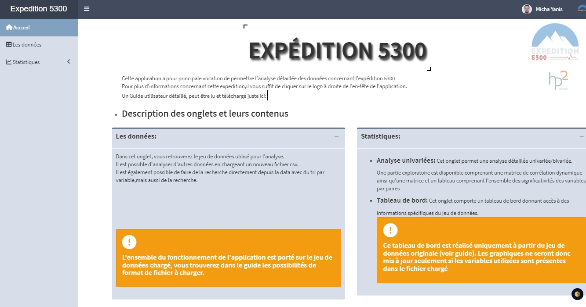
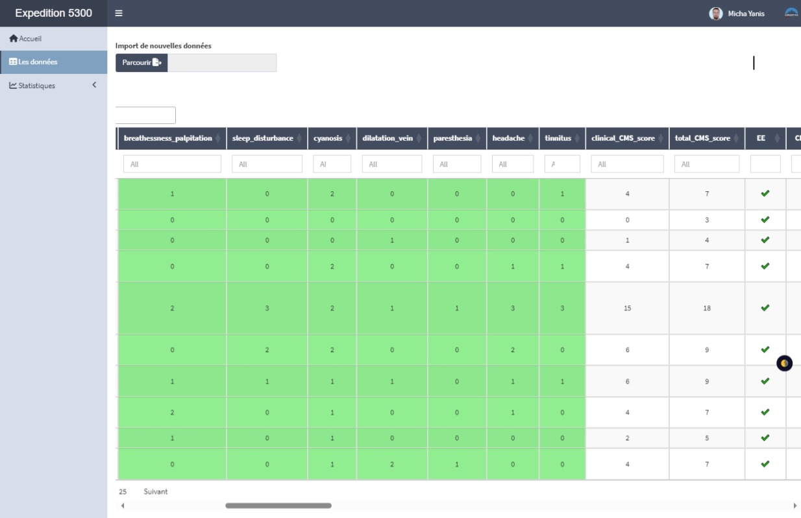
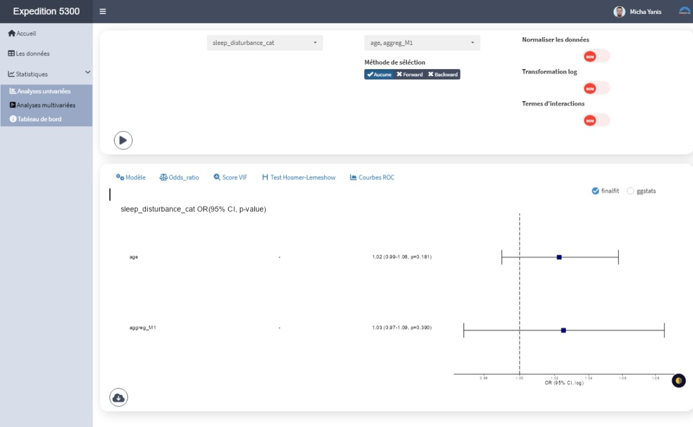
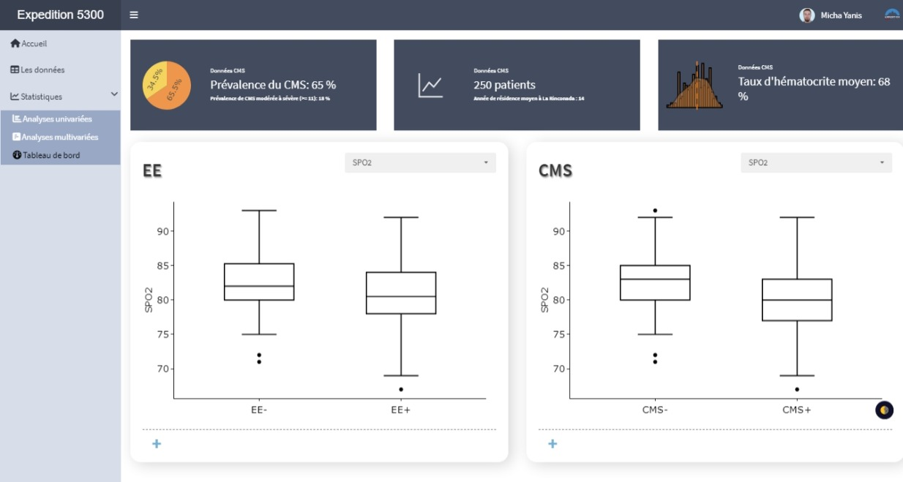

## Contexte

Dans le cadre du projet **Expédition 5300**, une analyse statistique approfondie des données physiologiques et cliniques de participants vivant en haute altitude a été réalisée afin d’étudier les mécanismes associés à la **maladie chronique des montagnes (CMS)** (Voir projet Analyses [ici](stage-m1.qmd)).

Afin de faciliter l’exploitation de ces analyses par les équipes de recherche et d’assurer leur pérennité dans le temps, une **application Shiny dédiée** a été développée en parallèle du travail statistique.

## Objectifs de l’application

L’application *ExpeditionApp* répond à deux objectifs principaux :

- Fournir une **synthèse interactive des analyses réalisées** dans le cadre du projet Expédition 5300, en permettant aux chercheurs d’explorer dynamiquement les résultats liés aux scores de symptômes et aux variables physiologiques.  
- Permettre la **réutilisation et l’actualisation des analyses** à partir de bases de données mises à jour, le projet étant toujours en cours.

Cette approche vise à garantir un **suivi continu des résultats**, tout en réduisant la charge liée à la reproduction manuelle des analyses.

## Besoins utilisateurs

Les besoins identifiés avec les équipes de recherche étaient les suivants :

- Mettre à jour facilement le **jeu de données** avec de nouvelles observations.  
- Disposer de l’**ensemble des analyses réalisées pour l’étude**, accessibles depuis une interface unique.  
- Permettre la **reproduction automatique des analyses existantes**, ainsi que l’intégration de nouvelles analyses via des actions simples (clics utilisateurs).  
- Offrir une **visualisation claire, rapide et synthétique** des données et des résultats statistiques.  
- Garantir un **niveau de sécurité**, avec un accès restreint à un groupe d’utilisateurs autorisés via une authentification sécurisée.

## Choix techniques et architecture

- Développement de l’application avec **R Shiny**, en s’appuyant sur le framework **{golem}**.  
- Utilisation de **{golem}** afin de garantir :
  - une architecture modulaire,
  - une meilleure maintenabilité du code,
  - une sécurité renforcée,
  - une application robuste et évolutive.
- Séparation claire entre logique métier, visualisation et gestion des données.

## Compétences développées

- **Développement d’applications Shiny avancées** : conception d’une application interactive orientée recherche, pensée pour être réutilisable et accompagner les chercheurs dans la suite de leurs recherches.  
- **Architecture robuste avec {golem}** : structuration modulaire du code, séparation des responsabilités et amélioration de la maintenabilité et de la sécurité de l’application.  
- **Reproductibilité et science des données** : intégration des analyses statistiques dans une application permettant leur reproduction automatique à partir de données mises à jour.  
- **Data visualisation interactive** : création de graphiques dynamiques facilitant l’exploration des résultats et l’interprétation des analyses statistiques.  
- **Sécurité et contrôle d’accès** : prise en compte des enjeux de confidentialité des données avec une gestion des accès restreinte à un groupe d’utilisateurs autorisés.  
- **Communication scientifique** : transformation d’analyses complexes en outils visuels accessibles à des publics variés (chercheurs, cliniciens, décideurs).

## Aperçu de l’application

Cette section présente les principales interfaces de l’application Shiny développée dans le cadre du stage.  
Chaque page correspond à une étape clé du parcours utilisateur, de la découverte des données à leur analyse approfondie.

### Page d’accueil

La page d’accueil permet de présenter le contexte du projet *Expedition 5300* ainsi que les objectifs de l’application.  
Un guide utilisateur est également disponible et téléchargeable pour l'accompagner et le former sur son utilisation.

{fig-align="center" width="85%"}

### Exploration des données

Cette page permet d’explorer la base de données utilisée pour l’étude.  
Les utilisateurs peuvent visualiser les variables disponibles, vérifier la complétude des données et effectuer une première inspection descriptive.

{fig-align="center" width="85%"}

### Analyses univariées

Cette page est dédiée à l’analyse univariée des variables cliniques et des scores de symptômes.  
Les outils interactifs permettent d’explorer les distributions et de comparer les groupes à l’aide de tests statistiques appropriés.

{fig-align="center" width="85%"}

### Analyses multivariées

Cette page permet de construire et d’explorer des modèles multivariés, notamment des modèles de régression logistique.  
Elle offre une visualisation claire des performances des modèles ainsi que des indicateurs de qualité d’ajustement.

{fig-align="center" width="85%"}

### Tableau de bord

Le tableau de bord fournit une vue d’ensemble synthétique des données et des résultats principaux.  
Il a pour objectif de faciliter une compréhension rapide des tendances globales et d’aider à la prise de décision.

{fig-align="center" width="85%"}

::: {.callout-note}
**Note de confidentialité**

Les données utilisées dans cette application ainsi que les résultats chiffrés sont confidentiels.  
La description se concentre sur les **fonctionnalités**, les **choix techniques** et les **compétences mobilisées**, sans exposer de données sensibles.
:::