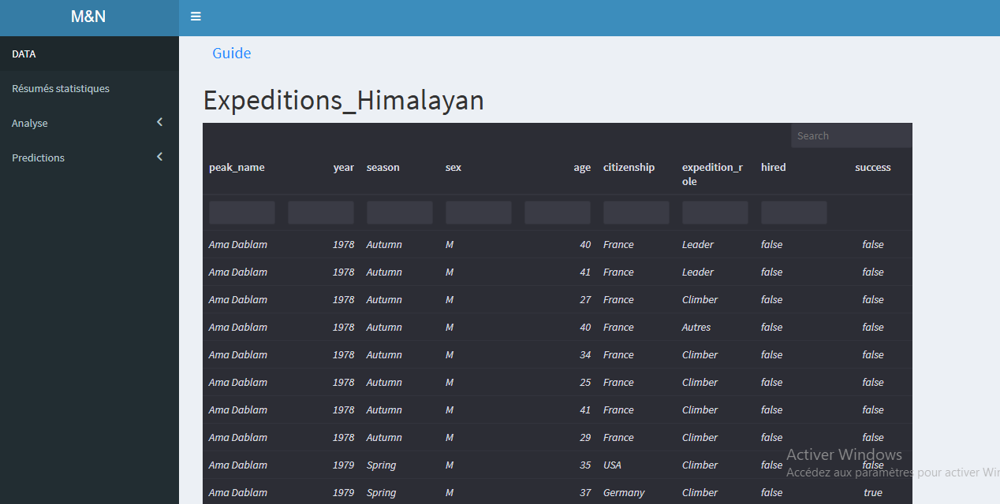
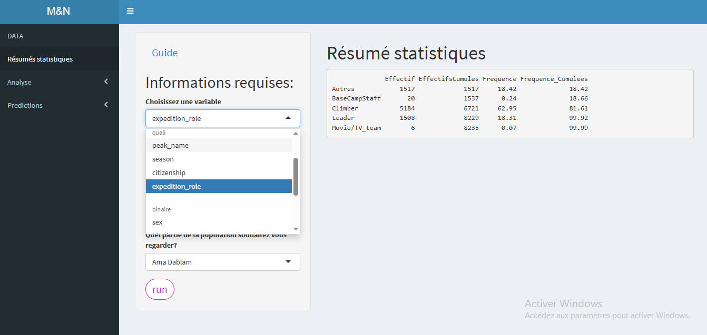
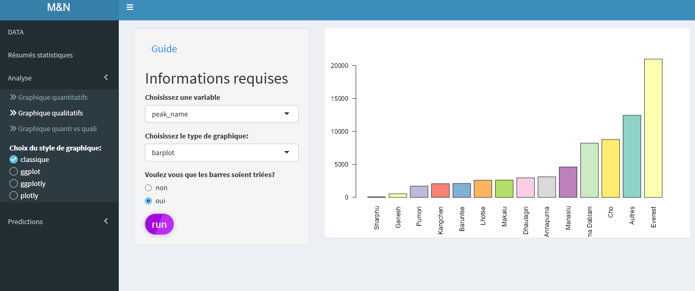
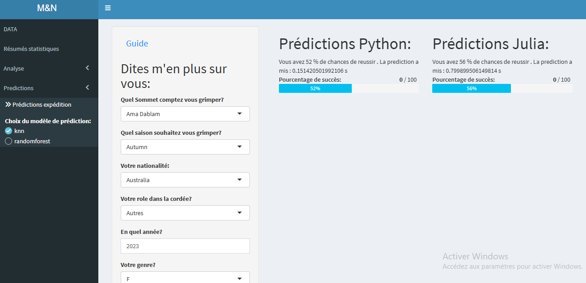

## Contexte

Ce projet a été réalisé dans le cadre de l’UE *Logiciels spécialisés* du Master, en binôme, avec pour objectif de mettre oeuvre l’ensemble des étapes d’un projet de science des données, depuis la recherche du jeu de données jusqu’à la réalisation d’une interface interactive intégrant des méthodes d’apprentissage automatique.

Nous avons choisi de travailler sur un jeu de données recensant des **expéditions himalayennes**, contenant des informations détaillées sur les grimpeurs, les expéditions et leurs issues. Parmi les variables disponibles, la variable `success`, indiquant le succès ou l’échec d’une expédition, s’est révélée particulièrement pertinente pour aborder des problématiques de **prédiction** en apprentissage supervisé.

Le jeu de données, fourni au format CSV, comprend **76 519 individus et 21 variables**. Cependant, celui-ci s’est avéré peu exploitable en l’état : données manquantes, incohérences, variables hétérogènes et absence de structuration adaptée à l’analyse statistique et au machine learning. Une part importante du projet a donc consisté en un travail approfondi de **nettoyage et de préparation des données**.

Ce projet avait également une dimension pédagogique forte : il s’agissait d’une **initiation au langage Julia**, tout en comparant ses performances et sa prise en main à celles d’outils plus classiques comme Python, dans un contexte de machine learning appliqué.

## Objectifs

Les objectifs du projet étaient multiples :

-   Réaliser un **travail de recherche exploratoire** afin de comprendre le contexte du jeu de données et les problématiques associées aux expéditions himalayennes.
-   Mettre oeuvre une **analyse exploratoire et un traitement approfondi des données**, afin de rendre le jeu de données exploitable pour l’analyse statistique et l’apprentissage supervisé.
-   Mettre en place des **modèles d’apprentissage automatique supervisé** visant à prédire le succès ou l’échec d’une expédition.
-   Comparer différentes approches et écosystèmes logiciels, en particulier **Python** et **Julia**, pour des tâches de machine learning.
-   Découvrir et manipuler l’interopérabilité entre plusieurs langages au sein d’une même application: ici faire fonctionner du code **python** et **julia** au sein d'une interface **shiny R**.
-   Concevoir et développer une **interface interactive** permettant:

1.  l'intégration des visualisations, des analyses et des résultats des modèles.
2.  la comparaison des différents packages de visualisations au sein du language **R** (`base`,`ggplot2`,`plotly`).

## Méthodologie

-   **Recherche et compréhension du jeu de données** Analyse du contexte des expéditions himalayennes et étude de la signification des variables afin d’évaluer leur pertinence pour l’analyse statistique et la prédiction du succès d’une expédition.

-   **Gestion des données manquantes**

    -   Suppression des valeurs manquantes pour les variables secondaires ou peu informatives.
    -   Imputation des valeurs manquantes pour les variables considérées comme **primordiales pour la prédiction**, afin de conserver un maximum d’individus exploitables.

-   **Prétraitement et harmonisation des données**

    -   Agrégation de variables catégorielles.
    -   Transformation de variables quantitatives.
    -   Création de nouvelles variables pertinentes (par exemple : nombre de personnes dans la cordée d’un grimpeur).
    -   Harmonisation des formats et des typologies de données pour garantir leur cohérence.

-   **Analyse exploratoire des données (EDA)**

    -   Tests statistiques et visualisations croisant la variable cible *success* avec les variables explicatives.
    -   Objectif : réaliser une **première sélection des variables pertinentes** en vue de la modélisation prédictive.

-   **Formatage des données pour le machine learning**

    -   Encodage des variables catégorielles (One-Hot Encoding).
    -   Normalisation et mise à l’échelle des variables quantitatives.
    -   Préparation de jeux de données compatibles avec les modèles supervisés.

-   **Modélisation prédictive**

    -   Utilisation de modèles volontairement simples afin de faciliter la **comparaison entre Julia et Python** :
        -   K-Nearest Neighbors (KNN)
        -   Random Forest
        -   Support Vector Machines (SVM)

-   **Conception de l’interface interactive**

    -   Intégration des modèles d’apprentissage automatique au sein d’une application **Shiny**.
    -   Objectif principal : permettre à un utilisateur non initié au machine learning de **tester de manière ludique** la prédiction du succès ou de l’échec d’une expédition himalayenne en fonction de différentes conditions (profil du grimpeur, caractéristiques de l’expédition, etc.).

-   **Visualisation des données**

    -   Implémentation de graphiques et visualisations avec comparaisons de trois packages complémentaires :
        -   graphiques de `base` R
        -   `ggplot2`
        -   `plotly` pour des visualisations interactives

## Outils utilisés

-   **Julia**
    -   Prétraitement des données (nettoyage, transformation, sélection de variables)
    -   Analyse exploratoire des données
    -   Apprentissage automatique avec `MLJ`
-   **Python**
    -   Apprentissage automatique avec `scikit-learn`
    -   Comparaison des performances et des méthodologies avec Julia
-   **R / Shiny**
    -   Développement de l’interface interactive
    -   Visualisation des données et des résultats
    -   Intégration des traitements et modèles issus de Julia et Python via des packages R dédiés

## Compétences développées

-   **Prétraitement et nettoyage de données complexes** : gestion d’un jeu de données volumineux et hétérogène, traitement des valeurs manquantes, harmonisation des formats et création de variables pertinentes pour l’analyse et la prédiction.

-   **Analyse exploratoire des données** : exploration statistique et graphique des relations entre la variable cible (`success`) et les variables explicatives afin d’identifier les facteurs les plus influents.

-   **Machine Learning supervisé** : mise en oeuvre et comparaison de modèles prédictifs (KNN, Random Forest, SVM) dans une logique pédagogique et comparative entre plusieurs langages.

-   **Approche multi-langages en data science** : utilisation conjointe de **Julia**, **Python** (scikit-learn) et **R**, et intégration de ces environnements au sein d’un même projet analytique.

-   **Développement d’applications interactives** : conception d’une application **Shiny** permettant à des utilisateurs non spécialistes de tester des scénarios prédictifs de manière intuitive et ludique.

-   **Visualisation de données** : création de visualisations statiques et interactives avec les packages `base R`, `ggplot2` et `plotly`, adaptées à l’exploration et permettant un retour critique sur leurs avantages et leurs inconvénients.

-   **Vulgarisation et pédagogie du Machine Learning** : transformation de modèles et concepts complexes en outils accessibles, favorisant la compréhension des mécanismes de prédiction auprès d’un public non initié.

-   **Travail collaboratif et gestion de projet** : réalisation d’un projet académique en binôme, depuis la définition de la problématique jusqu’au développement de l’interface et des modèles prédictifs.

Vous pouvez retrouver une partie du jeu de données utilisés ici:

```{r,cache = TRUE,echo=FALSE,eval = TRUE}
require(DT)
data <- read.csv("ML/data_himalayan.csv")
DT::datatable(
        data = data,
        editable = FALSE,                # Permet l'édition des cellules du tableau.
        options = list(
          autoWidth = FALSE,
          language = list(
            info = "Individus _START_ à _END_ sur un total de _TOTAL_ Individus",
            lengthMenu = "Afficher _MENU_ individus",
            search= "Recherche : ",
            paginate = list(previous = 'Précédent', `next` = 'Suivant')
          ),
          pageLength = 10,
          lengthMenu = c(10, 50, nrow(data)),
          searchHighlight = TRUE,
          columnDefs = list(
            list(
              targets = c(8),
              render = JS(
                "function(data, type, row) {",
                "  return data == 'false' ? '\u274c' : '\u2714\ufe0f';",
                "}"
              )
            ),
            list(
              targets = "_all",
              className = "dt-center"
            )
          )
        ),
        filter = 'top',
        rownames = FALSE
      ) %>%
        formatStyle(
          columns = c('hired','solo','oxygen_used','died','injured'),
          Color = styleEqual(c("true", "false"), c('darkgreen', 'darkred')),
          fontFamily = "-apple-system, BlinkMacSystemFont, Segoe UI, Helvetica, Arial, sans-serif",
          width = "100%"
        )

```

## Aperçu de l'application

### 1. Données



*Tableau interactif (package DT) permettant de visualiser, modifier et enrichir les données.*

### 2. Résumé des données



*Résumé statistiques des informations : estimateurs statistiques pour les variables continues, effectif et fréquence pour les variables catégorielles.*

### 3. Visualisation



*Graphiques permettant l'exploration visuelle du jeu de données, mais également de comparer ces derniers en fonction du package de grpahique utilisés*

### 4. Prediction



*Interface interactive de prédiction : l’utilisateur peut saisir ses propres informations et obtenir une estimation de probabilité de succès d’une expédition himalayenne selon les modèles supervisés implémentés.*
