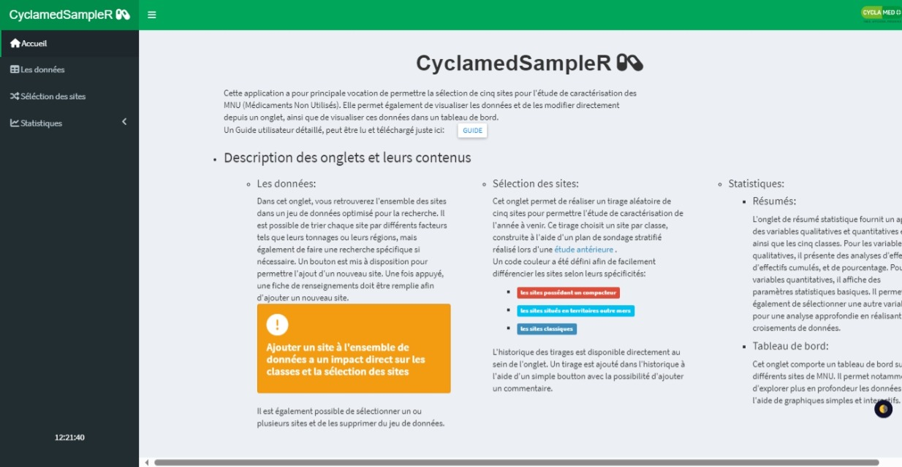
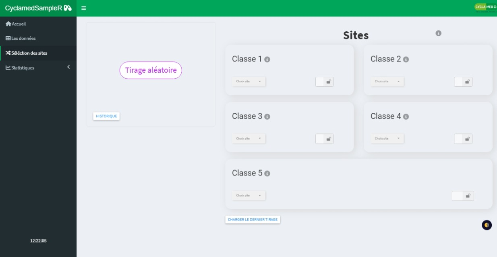
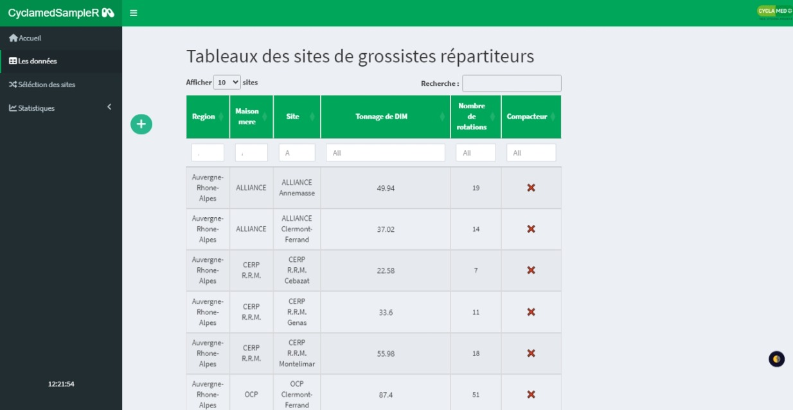
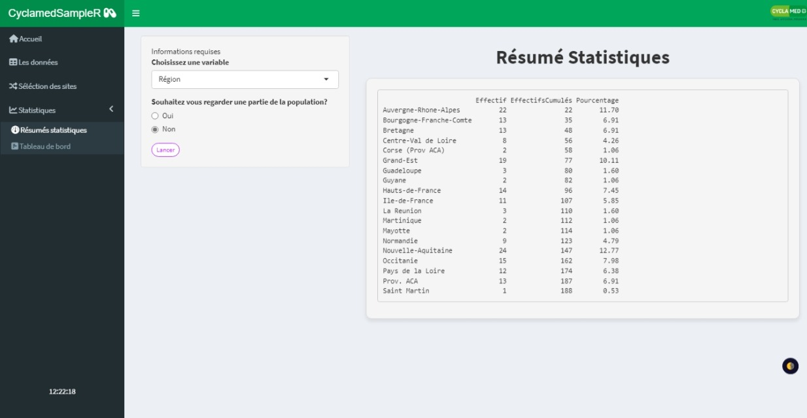
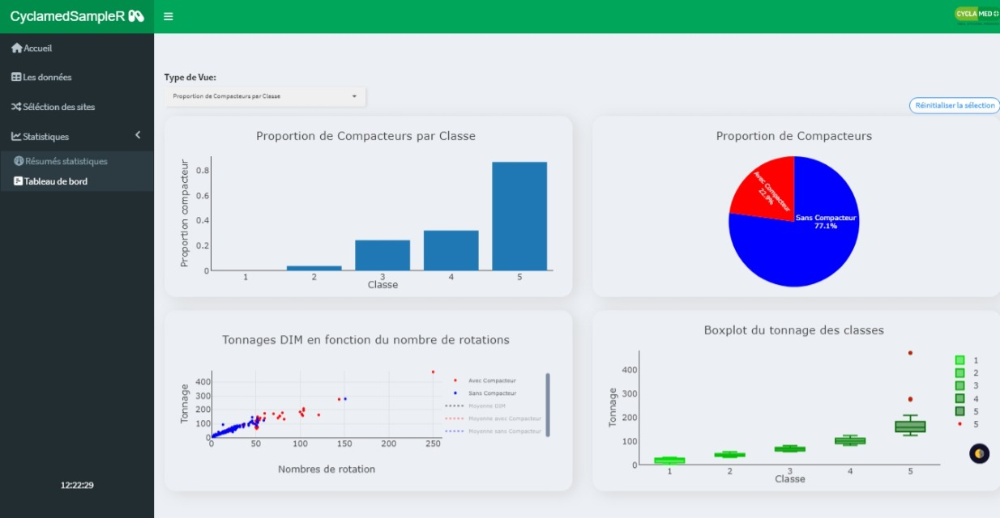

## Contexte

Cyclamed est l’éco-organisme en charge de la gestion des *M*édicaments *N*on *U*tilisés (*MNU*) en France.\
Dans ce cadre, Cyclamed réalise chaque année une étude de caractérisation des déchets afin d’identifier et de quantifier les composantes spécifiques contenues dans les Déchets Issus des Médicaments (DIM).

Cette étude a permis de définir une méthode d’échantillonnage, qui doit être appliquée et mise à jour chaque année en fonction de l’évolution des sites et des volumes collectés.

----

## Objectifs du projet

Le projet consistait à développer une application Shiny répondant à plusieurs objectifs opérationnels.

**1. Automatiser la méthode d’échantillonnage**

Le premier objectif était de faciliter la mise en œuvre de la méthode d’échantillonnage définie lors de l’étude de caractérisation, en automatisant son application annuelle. L’outil devait permettre de reproduire la méthodologie de manière fiable, tout en limitant les interventions manuelles et les risques d’erreur.

**2. Visualiser et mettre à jour les données**

Le second objectif était de proposer un jeu de données interactif et visuel, permettant :

-   d’explorer les données de caractérisation,

-   de les modifier annuellement

-   de prendre en compte les évolutions du terrain (ajout, suppression ou modification de sites de stockage).

Cette fonctionnalité a été mise en œuvre à l’aide du package `DT`, offrant une manipulation intuitive des données.

**3. Faciliter la prise de décision via un tableau de bord**

Enfin, l’application devait fournir une vue d’ensemble des données à travers un tableau de bord synthétique, afin d’aider les équipes de Cyclamed à :

-   suivre la répartition des tonnages de DIM par sites
-   analyser les volumes collectés
-   appuyer les décisions liées à la caractérisation annuelle.

Le tableau de bord constitue ainsi un outil phare pour permettre une vision globale des données et l’aide à la décision.

----

## Besoins utilisateurs

L’application devait répondre aux besoins fonctionnels suivants :

-   Mettre à jour la liste des cinq sites de grossistes-répartiteurs à caractériser.

-   Redéfinir les fourchettes de tonnages récupérés par site, pour chaque classe de grossistes-répartiteurs.

-   Disposer de la liste des sites par classe.

-   Relancer la sélection aléatoire des sites en outre-mer et des sites équipés de compacteurs.

----

## Compétences développées

-   **Programmation R avancée**\
    Développement d’une application interactive avec **Shiny**, structurée à l’aide du framework `golem`.\
    L’utilisation de `golem` a permis de concevoir une application plus **robuste**, **maintenable** et **sécurisée**, en séparant clairement la logique métier, l’interface utilisateur et les traitements, et en facilitant le portage et les mises à jour annuelles.

-   **Data visualisation avancée**\
    Conception de visualisations statistiques avec `ggplot2` et `plotly`, intégrant des graphiques interactifs et des interactions entre visualisations pour faciliter l’exploration et l’analyse des données.

-   **Développement web pour applications data**\
    Utilisation de **HTML**, **SCSS** et **JavaScript** pour améliorer l’ergonomie, l’esthétique et la réactivité de l’application, et proposer une interface utilisateur adaptée à un usage opérationnel.

----

## Aperçu de l’application

L’application Shiny développée pour Cyclamed permet de gérer la caractérisation annuelle des déchets issus des médicaments (DIM) de manière interactive et intuitive.\
Voici les principales fonctionnalités à travers des captures d’écran :

### 1. Accueil

 *Page d’accueil avec navigation principale vers les différentes sections de l’application.*

### 2. Sélection des sites

 *Sélection interactive des sites à caractériser, avec possibilité de mettre à jour la liste et de relancer la sélection aléatoire. Un historique des séléctions est également disponible.*

### 3. Données

 *Tableau interactif (package DT) permettant de visualiser, modifier et enrichir les données.*

### 4. Résumé des données

 *Vue synthétique des informations clés : tonnages, répartition par site et par classe de grossiste-répartiteur.*

### 5. Visualisation

 *Graphiques interactifs permettant l’exploration visuelle et l’analyse des tendances et indicateurs clés.*

Cette interface interactive permet à Cyclamed de **suivre, analyser et prendre des décisions rapidement**, tout en automatisant la séléction de sites et en garantissant la **fiabilité de la caractérisation annuelle**.

::: callout-note
**Note de confidentialité**

Les données utilisées dans le cadre de ce projet ainsi que les chiffres présentés sont confidentiels.\
La description se concentre volontairement sur les **méthodes**, les **outils** et les **compétences mobilisées**, plutôt que sur les résultats chiffrés.
:::
