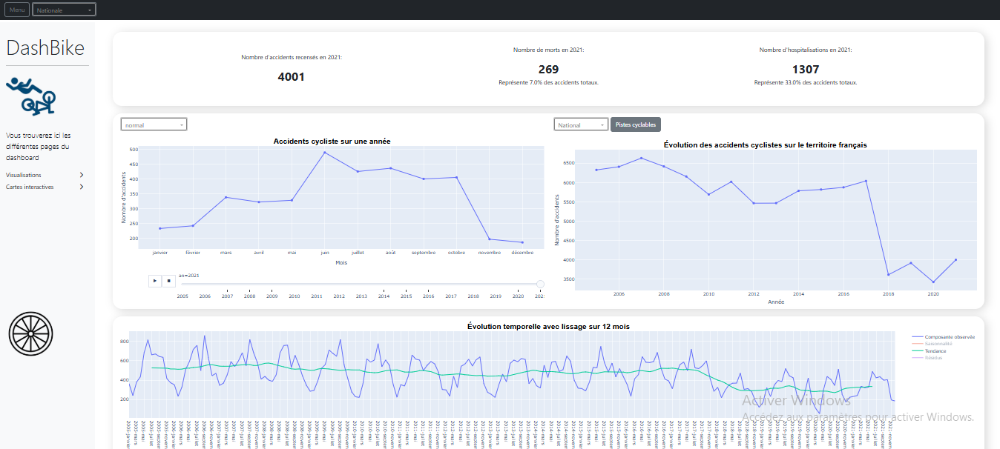
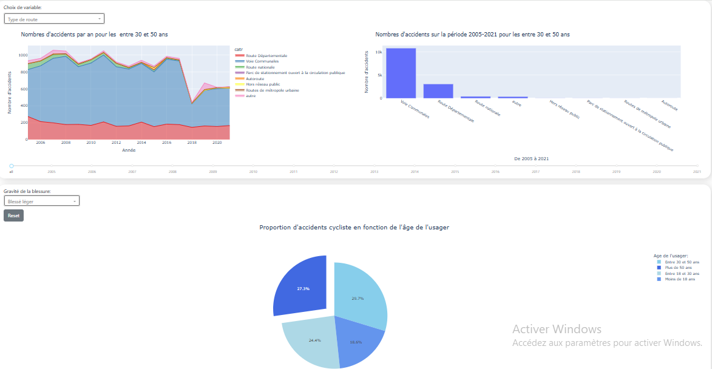
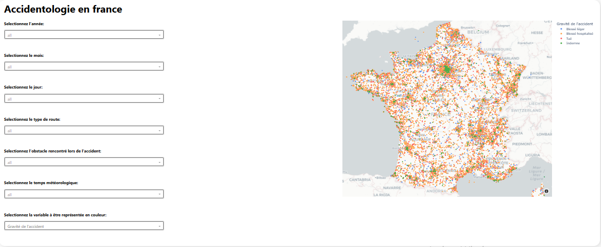
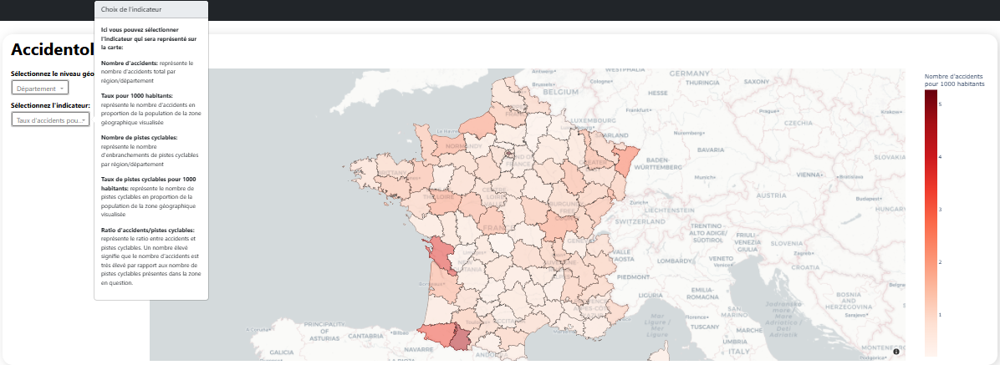

## Contexte

Dashbike est un tableau de bord interactif développé en Python dans le cadre du programme pédagogique de l’Open Data University.  
Le projet s’appuie sur des données publiques et vise à exploiter des données ouvertes à fort enjeu sociétal : les accidents de vélo en France.
Les données proviennent de data.gouv.fr et sont issues du Fichier BAAC (Bulletin d’Analyse des Accidents Corporels), administré par l’Observatoire national interministériel de la sécurité routière (ONISR).  
Le jeu de données recense, pour la période 2005–2024, l’ensemble des accidents corporels de la circulation survenus sur une voie ouverte à la circulation publique, impliquant au moins un véhicule,ayant entraîné au moins une victime nécessitant des soins.
Dans le cadre de ce projet, seules les observations impliquant au moins une personne à vélo ont été retenues.

Le tableau de bord est entièrement téléchargeable et modifiable depuis mon dépôt GitHub, dans une logique de transparence, de reproductibilité et de diffusion des analyses.

## Objectifs

L’objectif principal de Dashbike est double :

- **Sensibilisation** : rendre visibles et compréhensibles les dynamiques des accidents de vélo afin de mieux appréhender les risques associés à la pratique du vélo.

- **Aide à la prise de décision** : fournir un outil d’exploration interactif permettant d’identifier des zones à risque, des tendances temporelles ou géographiques, et d’orienter les politiques de prévention et d’aménagement.

Le tableau de bord permet de visualiser les accidents impliquant des cyclistes à différentes échelles :

- nationale
- régionale
- départementale

## Besoins utilisateurs

Ce type de projet s’adresse à plusieurs profils d’utilisateurs :

- **Collectivités territoriales** et **décideurs publics** : pour identifier les zones accidentogènes et prioriser les actions de sécurité routière.

- **Urbanistes** et **aménageurs** : pour appuyer la conception d’infrastructures cyclables plus sûres.

- **Chercheurs** et **analystes** : pour explorer les données et formuler des hypothèses.

- **Grand public** et **associations** : pour mieux comprendre les enjeux de sécurité liés à la pratique du vélo.

Les besoins fonctionnels principaux sont :

- une visualisation claire et synthétique des accidents à différentes échelles territoriales

- la possibilité de filtrer et comparer les données dans le temps et dans l’espace

- une interface intuitive permettant une prise en main rapide, sans expertise technique préalable.

## Choix techniques et architecture

Le tableau de bord a été développé en Python, avec les technologies suivantes :

- `Dash` : framework pour la création d’applications web analytiques interactives.

- `Plotly` : bibliothèque de visualisation pour des graphiques interactifs et dynamiques.

- `Pandas` / `NumPy` : manipulation, nettoyage et structuration des données.

## Compétences développées

- **Conception de tableaux de bord interactifs** : développement d’un tableau de bord Python (Dash) pensé pour explorer et communiquer des données complexes sur les accidents de vélo.  
- **Visualisation avancée de données** : création de graphiques dynamiques à différentes échelles géographiques et temporelles, avec mise en évidence des tendances et patterns structurels.  
- **Exploitation et valorisation de données ouvertes (open data)** : traitement et analyse de données publiques issues de data.gouv et d’autres sources complémentaires.  
- **Préparation et transformation des données (data engineering)** : croisement et enrichissement de jeux de données hétérogènes, intégration de données géographiques (GeoJSON : communes, régions, pistes cyclables) et mise en place d’un pipeline via ETL (**Knime**).  
- **Analyse avancée de séries temporelles** : exploration des dynamiques temporelles, lissage, décomposition en composantes observée, tendance, saisonnalité et résidus.  
- **Structuration et partage de projets analytiques** : organisation du code et des analyses pour une réutilisation et diffusion facile via GitHub.  
- **Orientation utilisateur et impact** : conception pensée pour sensibiliser, aider à la prise de décision et communiquer les résultats à des publics variés (décideurs, chercheurs, associations).

## Aperçu du tableau de bord

Le tableau de bord **Dashbike** est structuré autour de plusieurs vues complémentaires permettant d’explorer les accidents de vélo sous différents angles : temporel, descriptif et spatial. Chaque page répond à un objectif analytique précis et facilite la compréhension des phénomènes observés.

### Analyse temporelle des accidents

Cette page est dédiée à l’étude des évolutions temporelles des accidents de vélo.  
Elle permet d’analyser les tendances de long terme, la saisonnalité et les variations interannuelles, à l’aide de techniques de lissage et de décomposition des séries temporelles.

### Caractéristiques des accidents

Cette vue permet d’explorer les principales caractéristiques des accidents :  
profil des victimes, types de routes, environnement de l’accident, conditions météorologiques, etc.  
Elle offre une lecture descriptive essentielle pour identifier les facteurs associés aux accidents.

### Cartographie des accidents en France

Cette page propose une visualisation spatiale fine des accidents de vélo à l’échelle nationale.  
Chaque accident est représenté par un point géolocalisé, permettant d’identifier les zones à forte concentration et les dynamiques territoriales.

### Synthèse territoriale par régions et départements

Cette vue agrège les accidents à des niveaux administratifs plus larges (régions et départements).  
Elle permet de comparer les territoires à l’aide d’indicateurs synthétiques tels que :  

- nombre d’accidents
- taux d’accidents pour 1 000 habitants
- ratios entre accidents et infrastructures cyclables

Lien pour accès à une version du tableau de bord [ici](https://dashbike.onrender.com/)
