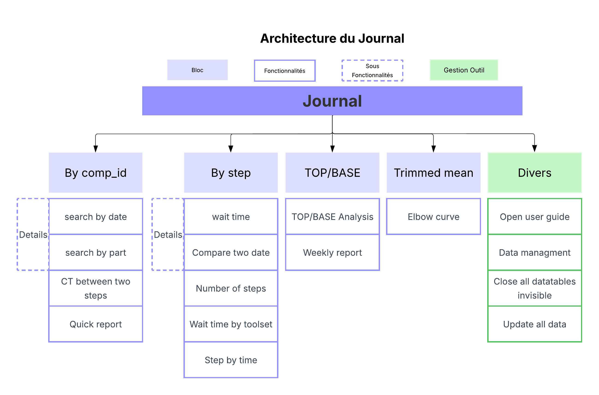
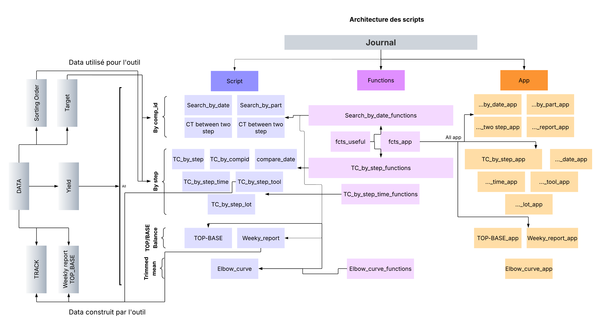

## Contexte

Mon stage s’est déroulé chez **Soitec**, entreprise de semi-conducteurs située à Bernin, proche de Grenoble, plus précisément au sein du **service Contrôle de Production** de la fabrique **B3**.  

La fabrique **Bernin 3** est une ancienne ligne de R&D convertie en ligne de production à fort volume, spécialisée dans le produit **POI** de Soitec.  
Depuis deux ans, la demande pour ce produit a fortement augmenté (+60%), nécessitant une extension de l’usine et des recrutements massifs (+360 personnes).  

Cette croissance rapide pose un double enjeu stratégique pour l’entreprise :  

- **Produire à grande échelle** pour répondre à la demande tout en maintenant la qualité et les délais,  
- **Continuer à innover et améliorer les procédés de fabrication**, afin de rester compétitive et pérenniser la ligne POI.  

Le rôle du **CDP (Continuous Development & Production)** est crucial dans ce contexte : il doit garantir la fluidité de la production, la réactivité face aux perturbations et la conformité aux exigences qualité.  
La maîtrise du **temps de cycle** est un levier stratégique majeur pour :  

- tenir les délais de livraison
- réduire les en-cours (WIP) et optimiser la capacité machine
- faciliter la planification et rendre la production plus prévisible

## Objectifs

Le projet de stage visait à améliorer la **visibilité et le pilotage des temps de cycle** au sein du service CDP. Les objectifs principaux étaient :  

1. **Analyse critique des travaux existants** :  
   - Évaluer les outils et méthodes précédemment utilisés pour identifier les limites et points d’amélioration.  
   - Comparer les approches « par lot » vs « par plaque ».  

2. **Définition et formalisation des temps de cycle** :  
   - Proposer une définition claire et partagée adaptée au contexte de B3.  
   - Développer des estimateurs pertinents pour mesurer ces temps de cycle.  

3. **Analyse et optimisation des temps de cycle** :  
   - Créer un outil dédié permettant au CDP de suivre les temps de cycle en temps réel.  
   - Fournir des indicateurs clairs et actionnables pour aider à la prise de décision.  

4. **Mise en place d’analyses reproductibles** :  
   - Suivi dynamique des lignes principales et des étapes critiques (goulots, détracteurs).  
   - Analyse historique pour comprendre les variations et dysfonctionnements passés.  
   - Analyse en continu pour détecter et corriger les anomalies en temps réel.  

5. **Formation du service CDP** :  
   - Présenter l’outil, sa logique et ses fonctionnalités.  
   - Expliquer les formules et indicateurs utilisés de manière interprétable et actionnable.  
   - Montrer des cas pratiques et recueillir les retours utilisateurs pour ajuster l’outil.

## Méthodologie

- **Démarche générale** : approche statistique structurée autour de deux axes complémentaires et deux types d’analyses pour répondre aux besoins de compréhension globale et aux exigences de réactivité du terrain.  

- **Axes d’analyse** :  
  - **Vision macroscopique** : aperçu global des temps de cycle par flow de production, calcul des indicateurs (moyenne, médiane, 90%) et suivi des tendances dans le temps pour identifier les dérives majeures.  
  - **Vision microscopique** : analyse par étapes de production pour suivre les temps d’attente, comprendre leurs causes et identifier les détracteurs critiques.  

- **Types d’analyses** :  
  - **État des lieux** : statistiques descriptives sur les données historiques pour comprendre les comportements passés et définir des valeurs cibles.  
  - **Pilotage opérationnel** : indicateurs dynamiques permettant d’alerter rapidement en cas de dérive et de suivre l’efficacité des actions correctives.  

- **Outils utilisés** :  
  - Initialement R, mais des restrictions de sécurité ont imposé l’usage de **JMP**.  
  - JMP permet une expérience utilisateur intuitive, des graphiques et tables interactives, et un scripting via **JSL** (JMP Scripting Language).  

- **Sources et préparation des données** :  
  - Bases **Yield**, mises à jour deux fois par jour et vision à la plaque adaptée à l’analyse.  
  - Certains paramètres non accessibles ont été reconstruits ou omis si nécessaire.  

- **Techniques statistiques** :  
  - Traitement et modélisation des données pour caractériser les temps de cycle.   - Réalisation de **simulations Monte Carlo sous R** pour comparer différents estimateurs (moyenne, médiane, moyenne tronquée, moyenne Winsorisée) et justifier le choix de l’indicateur le plus robuste pour le suivi des temps de cycle.
  - Statistiques descriptives et analytiques adaptées aux objectifs.  
  - Visualisation des données pour identifier anomalies et dérives.  
  - Modélisation statistique : **modèles linéaires** et **arbres de décision** pour identifier les paramètres influençant le temps de cycle.  

- **Limites méthodologiques** :  
  - Biais potentiels liés aux données pouvant affecter les analyses.  
  - Difficulté d’accès à certaines données et outils limitant la profondeur des analyses.  

## Résultats

- **Outil JMP intégré au CDP** :  
  - Création d’une interface interactive et centralisée via le **journal JMP**, permettant de lier et piloter différents scripts depuis un seul point d’entrée (boutons, menus).  
  - Interface intuitive pour les utilisateurs non experts, facilitant le lancement des analyses sans manipulation directe des scripts ou des données.  
  - Transmission efficace des analyses au sein du service, garantissant reproductibilité et autonomie des utilisateurs.  

- **Déploiement et formation** :  
  - Présentations et démonstrations auprès des équipes, points réguliers avec le directeur et responsable process.  
  - Guides utilisateur et développeur : documentation de l’architecture, des scripts et des méthodes pour faciliter la maintenance et les mises à jour futures.  
  - Version bêta testée par plusieurs membres du service pour recueillir les retours sur l’ergonomie, les fonctionnalités et identifier d’éventuels bugs.  

- **Analyses temps de cycle** :  
  - Analyses récurrentes pour suivi hebdomadaire, à l’échelle globale et par étape.  
  - Analyses de surveillance et de contrôle de production, incluant comparaison top/base.  
  - Participation à des missions annexes, notamment la mise en place du projet **INFICON** au sein de Soitec.  

## Compétences développées

- **Analyse et modélisation des temps de cycle** : conception d’indicateurs pertinents et reproductibles pour le suivi de production.  
- **Statistiques descriptives et analytiques** : traitement, visualisation et interprétation des données à l’échelle macroscopique et microscopique.  
- **Développement d’outils interactifs avec JMP** : création d’interfaces utilisateurs centralisées et intuitives pour la diffusion des analyses.  
- **Gestion de projet et documentation** : élaboration de guides utilisateur et développeur pour assurer la maintenance et la continuité de l’outil.  
- **Formation et communication** : présentation des analyses et outils aux équipes, clarification des indicateurs et accompagnement dans l’utilisation quotidienne.  
- **Résolution de problèmes opérationnels** : adaptation à des contraintes techniques et sécuritaires tout en maintenant la pertinence et la fiabilité des analyses.  

## Aperçu de l’outil

### Architecture côté utilisateur  

  

Schéma présentant la répartition des fonctionnalités pour l’utilisateur final :  
  - **By comp_id** : analyses globales des temps de cycle.  
  - **By step** : analyses des temps de cycle par étapes de production.  
  - **TOP/BASE** : analyses dédiées au pilotage des deux lignes principales pour coordination des lancements.  
  - **Trimmed mean** : analyses basées sur la moyenne tronquée pour un indicateur robuste.  
  - Bloc vert : fonctionnalités de gestion et mise à jour des jeux de données, accès aux guides utilisateur.  

### Architecture côté développeur  

  

Vue des scripts, données et dépendances côté développement, montrant comment l’outil est structuré pour assurer son bon fonctionnement et sa maintenance.

::: {.callout-note}
**Note de confidentialité**

Les données utilisées dans le cadre de ce projet ainsi que les chiffres exacts sont confidentiels.  
La description se concentre volontairement sur les **méthodes**, les **outils** et les **compétences mobilisées**, plutôt que sur les résultats chiffrés.
:::

